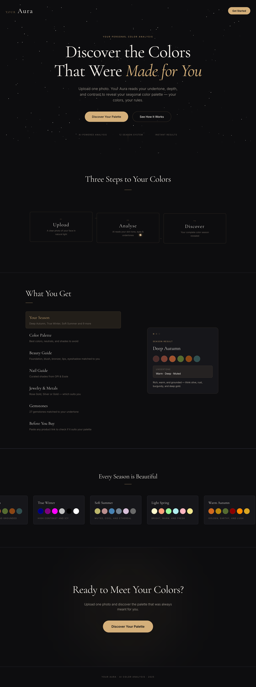
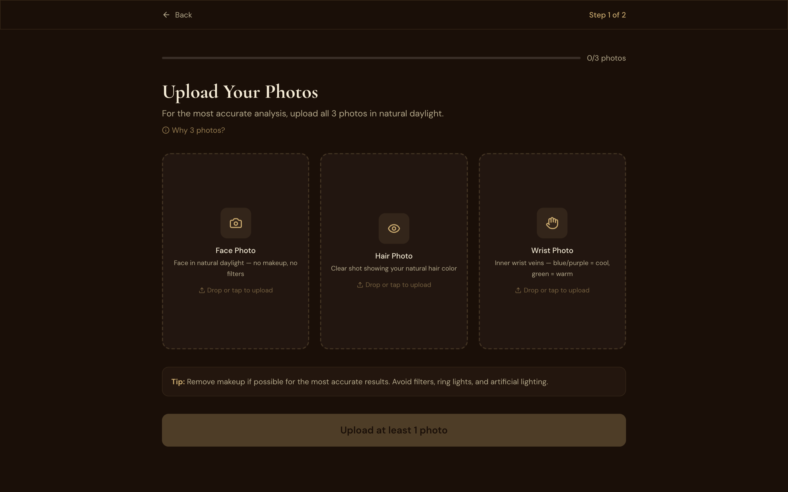
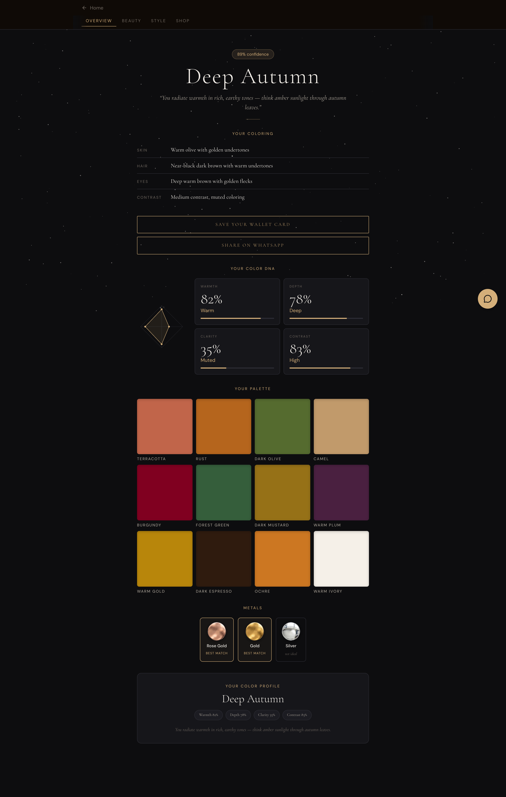
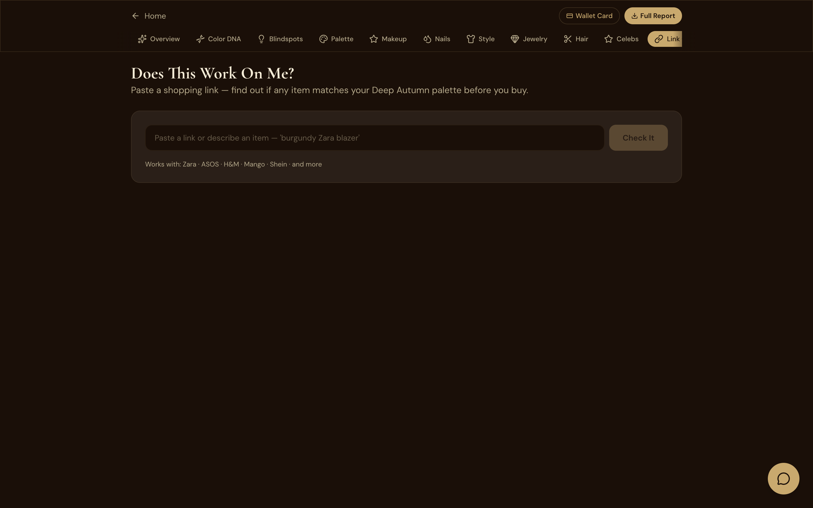
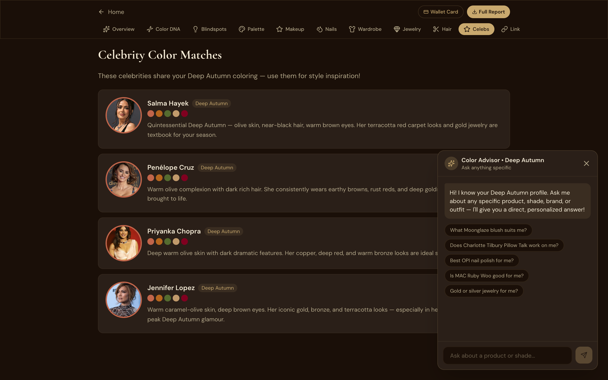

<div align="center">

# Aura — AI Personal Color Analysis

**Discover the colors that were made for you.**

A full-stack web app that analyzes a photo to determine your seasonal color type and generates personalized recommendations across wardrobe, makeup, hair, nails, gemstones, and metals — powered by Google Gemini vision.

[**Live Demo**](https://aura-azure-six.vercel.app) · [Report a Bug](https://github.com/HaneenAldossari/aura/issues)




</div>

---

## Overview

Personal color analysis (the 12-season system) is a $200–$500 in-person service that maps a person's natural skin, hair, and eye coloring to a palette of colors that flatter them. **Aura** brings that experience online — instantly, privately, and free.

Upload a single selfie, or try one of nine AI-generated sample faces (no personal photo required). The system classifies you into one of 12 color seasons, then surfaces a curated palette, makeup recommendations, hair color suggestions, gemstone and metal pairings, and a "Before You Buy" tool that scores any product photo against your palette.

## Features

- **AI Color Season Classification** — Gemini 2.5 Flash analyzes facial features (skin undertone, hair, eyes, contrast) and outputs one of 12 seasons with confidence scoring.
- **Canonical Palettes** — Every person classified as a given season sees the same curated 12-color palette, so results are deterministic and consistent across analyses.
- **Personalized Recommendations** — Makeup swatches, wardrobe colors, neutral anchors, hair color directions, gemstones, and best/avoid metals.
- **Privacy-First Demo Gallery** — 9 AI-generated faces with pre-computed analyses let users explore the full app without uploading their own photo.
- **Before You Buy** — Upload a product photo (clothing, bag, makeup) and the AI scores how well that color matches your seasonal palette, with similar in-palette alternatives.
- **AI Stylist Chatbot** — Conversational Gemini-powered advisor, grounded in the user's own analysis.
- **Multi-Stage Loading Animation** — A 6-stage loading screen ("Detecting features → Analyzing undertone → Determining your season → Cross-validating → Building your profile") matches the perceived effort of a real analysis.

## Screenshots

<table>
<tr>
<td></td>
<td></td>
</tr>
<tr>
<td align="center"><sub>Upload your photo or pick from 9 AI-generated samples.</sub></td>
<td align="center"><sub>Season, color DNA, palette, and metals — all derived from a single photo.</sub></td>
</tr>
<tr>
<td></td>
<td></td>
</tr>
<tr>
<td align="center"><sub>"Before You Buy" — score any product photo against your palette.</sub></td>
<td align="center"><sub>Conversational AI advisor grounded in your analysis.</sub></td>
</tr>
</table>

## Tech Stack

| Layer        | Technology                                                                  |
| ------------ | --------------------------------------------------------------------------- |
| Frontend     | React 19 · TypeScript · Vite · Tailwind CSS · React Router · Framer Motion  |
| Backend      | Node.js · Express · TypeScript (via `tsx`) · Multer · CORS                  |
| AI / Vision  | Google Gemini 2.5 Flash (via Google AI Studio)                              |
| Hosting      | Vercel (frontend) · Render (backend)                                        |
| Persistence  | In-memory session store (analysis results) · static JSON for demo samples   |

## Architecture

```
┌──────────────────┐    /api    ┌──────────────────┐
│  React + Vite    │ ─────────▶ │  Express server  │
│  (Vercel CDN)    │            │  (Render)        │
└──────────────────┘            └──────┬───────────┘
                                       │
                                       │ HTTPS
                                       ▼
                                 ┌─────────────────┐
                                 │  Google Gemini  │
                                 │  2.5 Flash      │
                                 └─────────────────┘
```

**Request flow:**
1. User uploads a photo (or picks a pre-computed sample) on the React client.
2. Client posts `multipart/form-data` to `POST /api/analyze`.
3. Server validates face count, calls Gemini with a structured prompt + base64 image.
4. Response is parsed, normalized to the front-end schema, and the canonical per-season palette is injected.
5. Result is stored in memory under a UUID session ID and returned to the client.
6. Subsequent calls (chat, shop check, etc.) reference that session for context.

## Local Development

### Prerequisites
- Node.js 20+
- A free [Google AI Studio API key](https://aistudio.google.com/apikey)

### Setup

```bash
git clone https://github.com/HaneenAldossari/aura.git
cd aura
cp .env.example .env
# edit .env and add your GEMINI_API_KEY
npm install
cd client && npm install && cd ..
```

### Run both servers

```bash
# Terminal 1 — backend on :3001
npx tsx server/index.ts

# Terminal 2 — frontend on :5173
cd client && npm run dev
```

Open http://localhost:5173.

### Pre-compute sample analyses (optional, one-time)

The repo ships with 9 pre-computed sample analyses in `server/demo-analyses/`. To regenerate them:

```bash
npx tsx scripts/precomputeDemoAnalyses.ts
```

## Deployment

The app is deployed across two free-tier services:

- **Frontend** → Vercel (auto-deploys on push to `main`, root directory: `client/`)
- **Backend** → Render (auto-deploys on push, build: `npm install`, start: `npx tsx server/index.ts`)

Required environment variables in production:

| Variable          | Where        | Value                                               |
| ----------------- | ------------ | --------------------------------------------------- |
| `GEMINI_API_KEY`  | Render       | your Google AI Studio API key                       |
| `CORS_ORIGINS`    | Render       | comma-separated list of allowed Vercel URLs        |
| `VITE_API_BASE`   | Vercel       | `https://your-render-url.onrender.com/api`          |

The `vercel.json` rewrite rule ensures direct links to client-side routes (`/analyze`, `/results/:id`) fall back to `index.html` for the SPA router.

## Project Structure

```
aura/
├── client/                    # React + Vite frontend
│   ├── public/
│   │   └── demo-faces/        # 9 AI-generated sample faces (static)
│   └── src/
│       ├── pages/             # Home, Analysis, Results
│       ├── components/        # Color swatches, palette grid, chatbot, etc.
│       ├── lib/api.ts         # Backend API client
│       └── data/              # Season palettes, makeup swatches
├── server/
│   ├── routes/                # /analyze, /chat, /tools (shop), /demo-load
│   ├── services/
│   │   ├── claudeVision.ts    # Gemini API wrapper
│   │   └── linkChecker.ts     # Shop tab product scoring
│   ├── prompts/               # System prompts for color analysis & chat
│   ├── utils/seasonPalettes.ts # Canonical 12-season palette table
│   └── demo-analyses/         # Pre-computed sample analyses (JSON)
└── scripts/
    └── precomputeDemoAnalyses.ts  # Re-generate sample analyses
```

## License

MIT — see [LICENSE](./LICENSE).

## Author

Built by **Haneen Aldossari**.
[GitHub](https://github.com/HaneenAldossari) · [LinkedIn](https://www.linkedin.com/in/haneen-aldossari)
