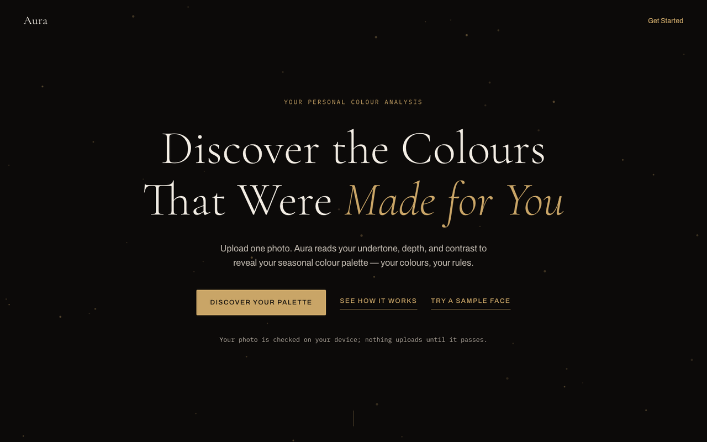

<div align="center">

# Aura v2 — AI Personal Color Analysis

**Discover the colors that were made for you.**

A full-stack web app that analyzes a photo to determine your seasonal color type and generates personalized recommendations across wardrobe, makeup, hair, nails, gemstones, and metals — powered by a vision LLM via OpenRouter.

[Report a Bug](https://github.com/HaneenAldossari/aura/issues)




</div>

---

## Overview

Personal color analysis (the 12-season system) is a $200–$500 in-person service that maps a person's natural skin, hair, and eye coloring to a palette of colors that flatter them. **Aura** brings that experience online — instantly, privately, and free.

Upload a single selfie, or try one of nine AI-generated sample faces (no personal photo required). The system classifies you into one of 12 color seasons, then surfaces a curated palette, makeup recommendations, hair color suggestions, gemstone and metal pairings, and a "Before You Buy" tool that scores any product photo against your palette.

> **This is aura-v2** — an enhanced rebuild of [aura](https://github.com/HaneenAldossari/aura). See [What's new in v2](#whats-new-in-v2).

## Features

- **AI Color Season Classification** — a vision LLM analyzes facial features (skin undertone, hair, eyes, contrast) through a structured decision tree and outputs one of 12 seasons with confidence scoring and a second-opinion cross-validation pass.
- **Canonical Palettes** — every person classified as a given season sees the same curated 12-color palette, so results are deterministic and consistent.
- **Paint-Chip Fan Deck** — the palette is presented as a fanned deck of designer paint chips; hover lifts a card to reveal its name, hex, and styling note; click copies the hex.
- **Personalized Recommendations** — makeup swatches, wardrobe colors, neutral anchors, hair color directions, gemstones, and best/avoid metals.
- **Privacy-First Demo Gallery** — 9 AI-generated faces with pre-computed analyses let users explore the full app without uploading their own photo.
- **Before You Buy** — upload a product photo (clothing, bag, makeup) and the AI scores how well that color matches your seasonal palette, with similar in-palette alternatives.
- **AI Stylist Chatbot** — conversational advisor grounded in your analysis, with live streamed responses and per-session history.
- **Reveal Moment** — first visit to your results plays a word-by-word season reveal with a gold shimmer sweep and a staggered fan-out of your palette.

## What's new in v2

**Correctness & AI**
- Fixed demo-mode detection (the OpenRouter migration previously left real analysis unreachable — every "analysis" silently returned canned demo data).
- All AI calls consolidated into one OpenRouter client with automatic 429 retry and optional model fallback (`OPENROUTER_FALLBACK_MODEL`).
- Photos are validated (magic bytes), EXIF-rotated, and downscaled to 1024px JPEG before hitting the model — a 10MB upload becomes ~200KB, cutting analysis latency from minutes to seconds *and* fixing face-detection failures on large images.
- Face-count checking is folded into the main analysis prompt (one round trip instead of two), and the prompt now forces an evidence-first undertone → depth → chroma assessment before naming a season.
- The accuracy harness (`npm run test:accuracy`) runs against any OpenRouter model via `MODEL_CLASSIFY` for benchmarking.

**Security & robustness**
- helmet, tiered rate limiting (strict on LLM routes), strict CORS allowlist, JSON body limit, chat input caps.
- Uploads live in memory only — nothing is written to disk, and the public `/uploads` mount is gone.
- Removed an open image-proxy endpoint (SSRF risk) and unused scraping code.
- Honest error contract: `{ error: <code>, message: <text> }` with real status codes — no more silent demo-data fallbacks masking provider failures.
- Sessions live in a TTL store (24h default, capped) instead of an unbounded object.

**Performance**
- Route-level code splitting: 547KB single bundle → ~230KB initial + lazy per-page chunks.
- Static imagery converted to WebP with sane dimensions: 62.5MB → 2.9MB.
- StarField background rewritten from 220 animated SVG circles to a single canvas loop (paused when the tab is hidden).
- Chat responses stream token-by-token over SSE.

**UX / UI / accessibility**
- Palette fan deck, sliding gold tab indicator, scroll reveals, page crossfades, gold-shimmer skeleton loaders, mobile bottom-sheet chat.
- Full keyboard support (upload zones, fan deck, tabs), gold `:focus-visible` ring, `aria-live` chat, `prefers-reduced-motion` respected throughout, contrast-bumped muted text.
- Chatbot is available on every results tab and keeps history per session.

**Code health**
- `Results.tsx` 1322 → 72 lines; pages decomposed into `pages/{results,home,analysis}/` components with a shared typed API layer (`client/src/lib/types.ts`) and reusable UI primitives.
- Removed ~15 dead components/files and 5 unused dependencies (three.js, recharts, puppeteer, legacy AI SDKs).

## Tech Stack

| Layer        | Technology                                                                  |
| ------------ | --------------------------------------------------------------------------- |
| Frontend     | React 19 · TypeScript · Vite 7 · Tailwind CSS 4 · React Router 7            |
| Backend      | Node.js · Express 5 · TypeScript (via `tsx`) · Multer · sharp · helmet      |
| AI / Vision  | OpenRouter — single provider layer (default: `google/gemini-3.8-flash`)      |
| Hosting      | Vercel (frontend + serverless API in `api/`)                                 |
| Persistence  | In-memory TTL session store · static JSON for demo samples                  |

## Architecture

```
┌──────────────────┐    /api    ┌──────────────────┐
│  React + Vite    │ ─────────▶ │  Express server  │
│  (Vercel CDN)    │            │  (Render)        │
└──────────────────┘            └──────┬───────────┘
                                       │ sharp downscale → base64
                                       ▼
                                 ┌─────────────────┐
                                 │   OpenRouter    │
                                 │  (vision LLM)   │
                                 └─────────────────┘
```

**Request flow:**
1. User uploads a photo (or picks a pre-computed sample) on the React client.
2. Client posts `multipart/form-data` to `POST /api/analyze`.
3. Server validates the image (magic bytes), EXIF-rotates, downscales to 1024px JPEG.
4. One vision call performs the face-count gate + full structured analysis; an optional second call cross-validates the season.
5. Response is normalized to the frontend schema and the canonical per-season palette is injected.
6. Result is stored in a TTL session store under a UUID and returned to the client.
7. Subsequent calls (chat, shop check) reference that session; chat streams over SSE.

## Local Development

### Prerequisites
- Node.js 20+
- A free [OpenRouter API key](https://openrouter.ai/keys)

### Setup

```bash
cd aura-v2
cp .env.example .env
# edit .env and add your OPENROUTER_API_KEY
npm install
cd client && npm install && cd ..
```

### Run both servers

```bash
# Terminal 1 — backend on :3001
npx tsx server/index.ts

# Terminal 2 — frontend on :5173
cd client && npm run dev
```

Open http://localhost:5173.

### Useful scripts

```bash
npm test                                   # unit tests (vitest)
npm run test:accuracy                      # season-accuracy benchmark (uses MODEL_CLASSIFY)
npx tsx scripts/probeModels.ts             # quick latency/sanity probe of candidate models
npx tsx scripts/precomputeDemoAnalyses.ts  # regenerate the 9 demo analyses
npx tsx scripts/convertImagesToWebp.ts     # one-time image optimization pass
```

## Deployment

Frontend and API deploy together to **one Vercel project**. The API lives in
`api/` as Vercel Functions; `server/handlers/` holds the shared implementation, and
`server/index.ts` is a local-dev adapter over the very same handlers.

The API is **stateless** — `/api/analyze` returns everything (~6 KB) and the browser
keeps it. Chat and the shop check take the analysis in the request body.

| Vercel project setting | Value |
| --- | --- |
| Root Directory | repository root (**not** `client/`) |
| Build Command | from `vercel.json` |
| Output Directory | `client/dist` |

Required environment variables in production:

| Variable             | Where   | Value                                                |
| -------------------- | ------- | ---------------------------------------------------- |
| `OPENROUTER_API_KEY` | Vercel  | your OpenRouter key (needs credit — see below)       |

`VITE_API_BASE` and `CORS_ORIGINS` are **not** set in production: the API is
same-origin under `/api`. `CORS_ORIGINS` only affects the local dev server.

### Models

One model per task, all through OpenRouter. Defaults in `server/utils/config.ts`.

| Variable          | Default                    | Used by                       |
| ----------------- | -------------------------- | ----------------------------- |
| `MODEL_CLASSIFY`  | `google/gemini-3.8-flash`  | season classification (vision) |
| `MODEL_CHAT`      | `google/gemini-3.8-flash`  | stylist chatbot                |
| `MODEL_SHOP`      | `google/gemini-3.8-flash`  | "Before You Buy" (vision)      |

`OPENROUTER_MODEL` and `OPENROUTER_CHAT_MODEL` are **deprecated** — still honored with a
warning so an existing deployment does not silently fall back to a withdrawn model.

> **These defaults are paid models and require OpenRouter credit.** The free Nemotron
> models this app previously used were withdrawn — both now return HTTP 404 — so a
> free-tier key can no longer run the analysis.
>
> Measured on `google/gemini-3.8-flash`: **~$0.0087 per analysis** (~$8.70 per 1000),
> ~19s end to end. Roughly 4,700 prompt tokens and 1,400 completion tokens, of which
> 470-1,380 are reasoning tokens — reasoning is mandatory on this endpoint and cannot
> be disabled, so `CLASSIFY_REASONING=false` is a no-op here.

Optional: `OPENROUTER_FALLBACK_MODEL` (tried when the primary call *fails*),
`MAX_TOKENS_CLASSIFY`, `CLASSIFY_REASONING`, `ANALYSIS_MODE`, `SESSION_TTL_HOURS`,
`MAX_FILE_SIZE`, `CORS_ORIGINS`.

## Roadmap / Recommendations

Ideas documented for future iterations:

1. **Real session persistence** — Upstash Redis (free tier) behind the existing session-store interface; Render's free tier wipes memory on restart.
2. **Unit tests + CI** — vitest for the pure functions (`parseJSON`, `normalizeResult`, `getCanonicalPalette`, `cleanResponse`, session TTL) plus a GitHub Actions workflow running `tsc --noEmit` and the tests.
3. **PDF export / share card** of the color report; PWA manifest for home-screen install.
4. **Arabic UI (i18n)** — the chatbot already answers in Arabic; the interface could follow.
5. **Model upgrades** — the accuracy harness makes it a one-line env change to A/B a paid vision model when accuracy matters more than cost.
6. **Analytics** — a PostHog funnel (land → upload → result → chat) to see where users drop off.

## License

MIT — see [LICENSE](./LICENSE).

## Author

Built by **Haneen Aldossari**.
[GitHub](https://github.com/HaneenAldossari) · [LinkedIn](https://www.linkedin.com/in/haneen-aldossari)
