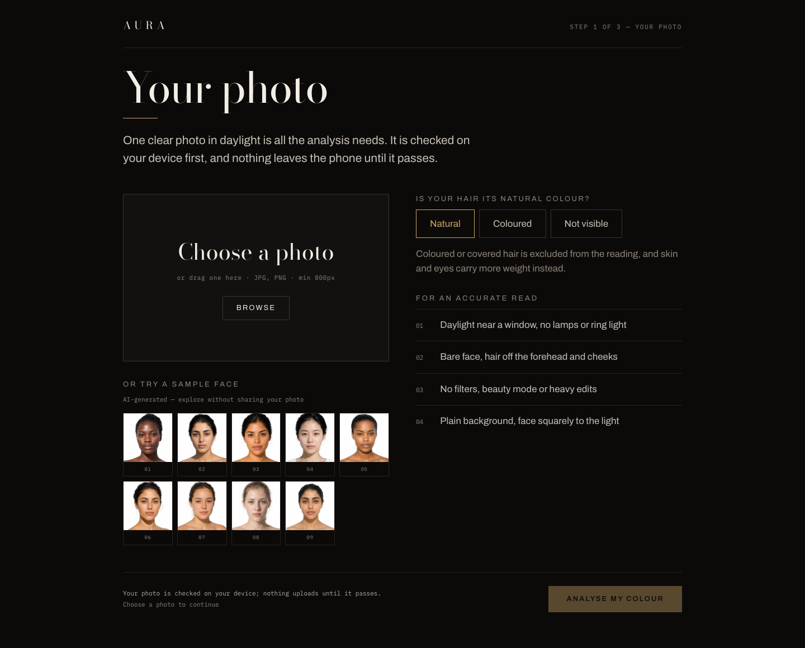
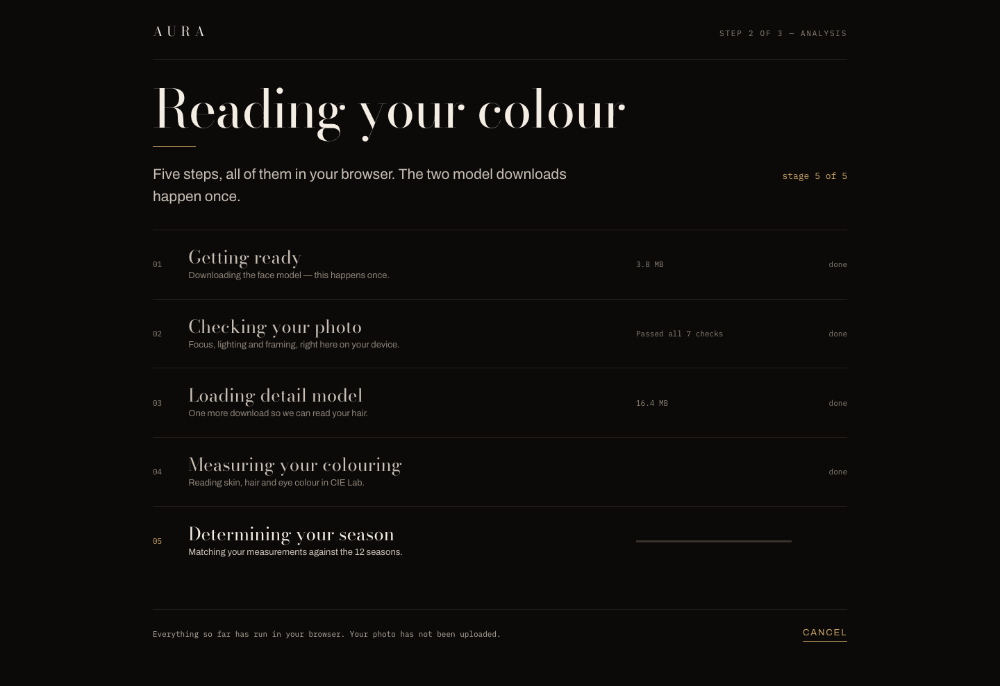
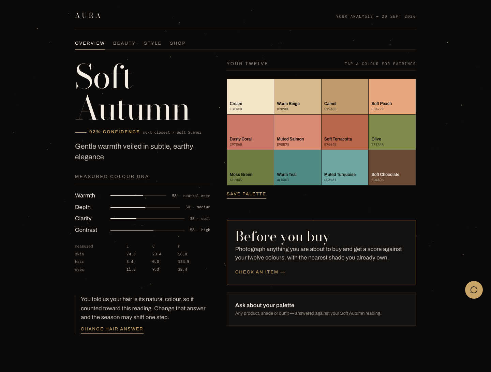
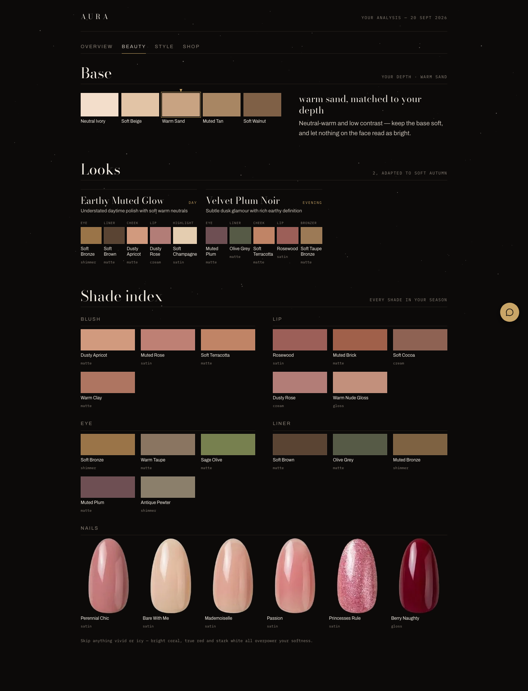
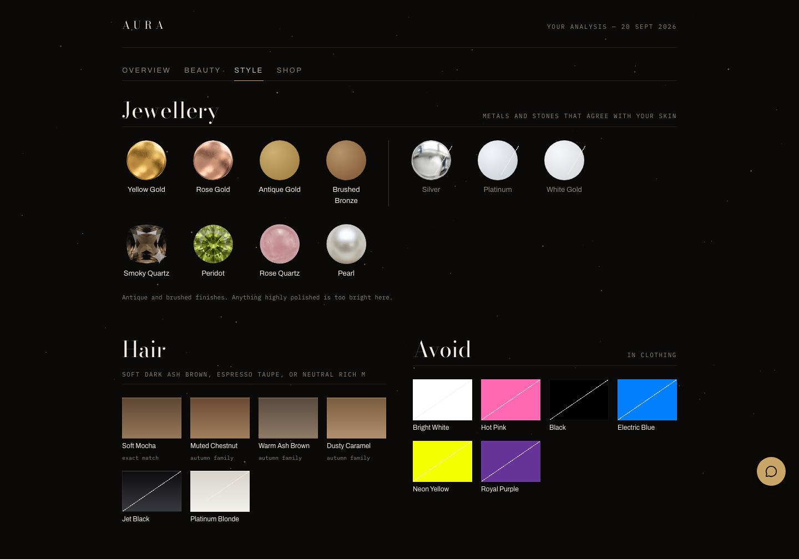
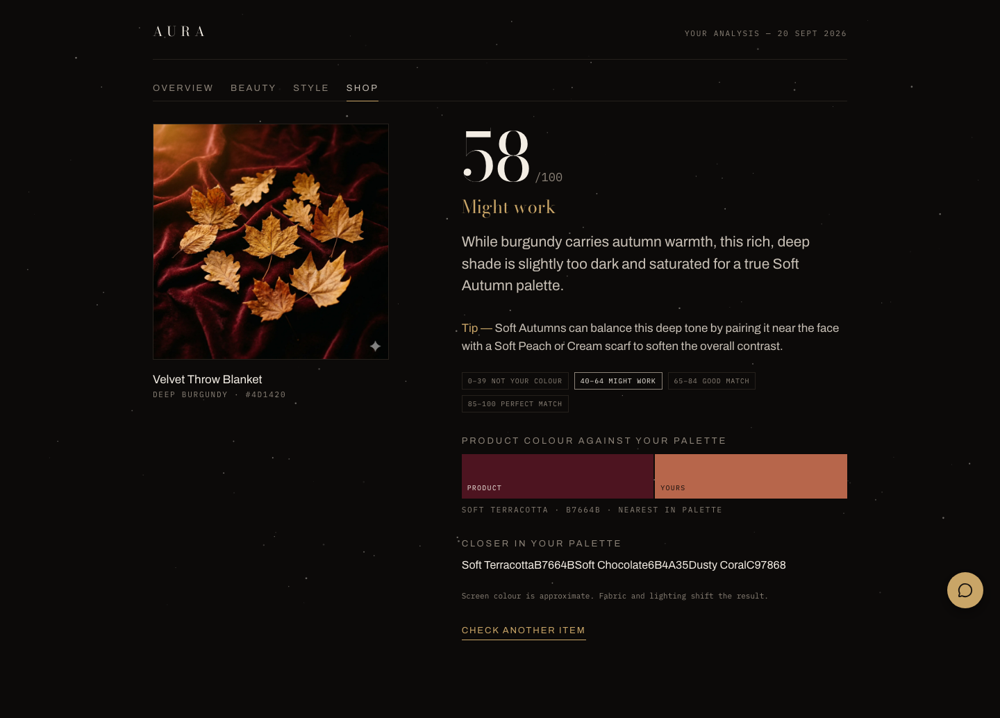
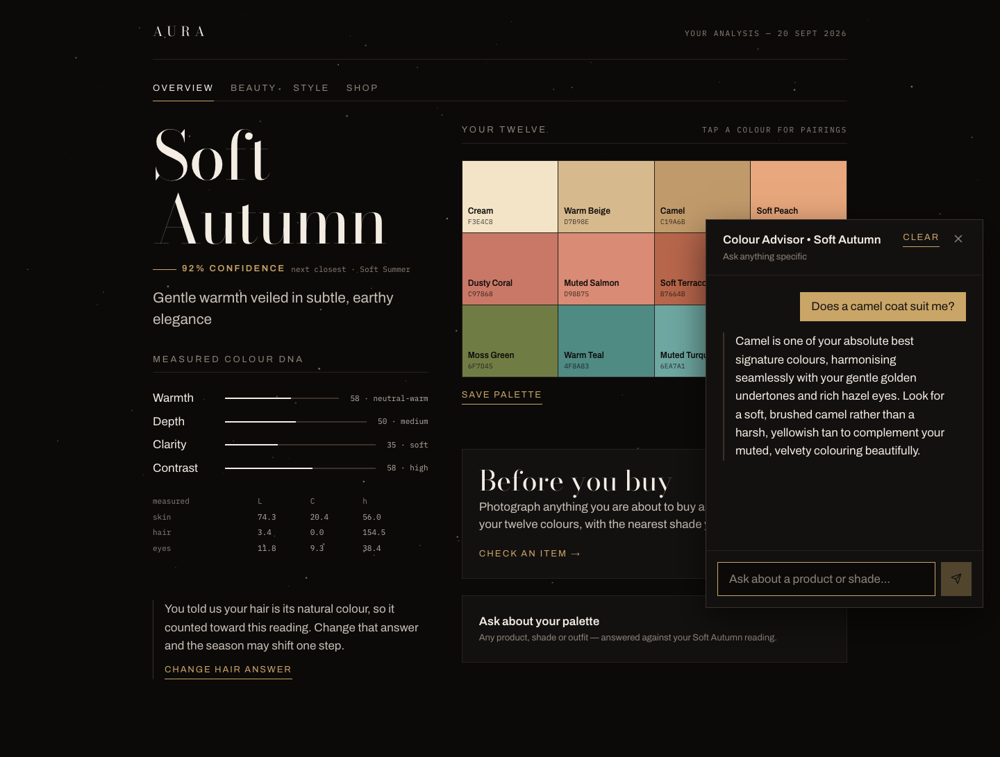

<div align="center">

# Aura

**Personal colour analysis, measured rather than guessed.**

One photo in. The twelve colours that suit you out — with the makeup shades,
the metals, and a score for anything you are about to buy.


</div>

---

## What it does

You upload one photo. Your skin, hair and eyes are measured **in your browser**,
in CIE Lab, and matched against the twelve seasons of the Sci\ART system. You
get your season, the twelve colours that belong to it, the makeup shades and
looks that suit you, the metals and stones that agree with your skin — and a
scoring tool for photographing something in a shop before you buy it.

The interesting part is not the answer. It is that the app can show you its
working, and that it disagrees with itself out loud when it is unsure.

---

## The measurement runs on your device

Most of this app is not an API call.

```
browser: decode → quality gate → landmarks → regions → features → canonical JPEG
   │ a photo that fails the gate never uploads — you get specific reasons, and
   │ the photo stays where it was
   ▼
POST /api/analyze   (canonical sRGB JPEG + the measured values)
   ▼
server: validate the features → rank the twelve seasons from them
   ▼
        vision model: the image and the measurements, never the ranking
   ▼
        agreement check → confidence cap, alternatives
   ▼
your palette, injected from canonical data → back to the browser
```

**The photo is checked before it is sent.** Focus, framing, lighting and colour
cast are all assessed on-device. A photo that fails never leaves the machine, so
nothing is spent on it and the advice is specific — "your face is too small in
the frame", not "something went wrong".

**Decoding uses WASM codecs, not canvas.** `canvas.getImageData()` is
colour-managed to the display profile and deliberately noised by
anti-fingerprinting modes in Firefox, Brave and Safari, so it cannot produce the
same pixels twice across browsers. `@jsquash` (libjpeg-turbo, libpng, libwebp
compiled to WASM) is deterministic everywhere. The same decoded pixels feed both
MediaPipe and our own sampling.

**Display P3 is converted before measurement, not after.** Reading an iPhone
photo as sRGB shifts the measured skin hue by 4 degrees — enough to flip the
undertone label from warm to neutral-warm, which is the difference between a
Spring and a Summer. Measured, recorded, and the reason `decode.ts` reads the
ICC profile.

**The MediaPipe models are pinned by version *and* checksum.** The URLs end in
`/1/`, not `/latest/`, and every download is verified against a SHA-256 that
throws on mismatch. A silent model update would change every measurement the
eval had recorded, with nothing in the repo having changed.

---

## The classification cross-checks itself

Two independent readings, deliberately kept apart.

The **rules** rank all twelve seasons from the measured CIE LCh values — hue,
value and chroma axes, each with its own weighting, plus a contrast range.

The **model** sees the photo and the measured numbers, and **never the
ranking**. Shown the rules' answer it would anchor on it, and the agreement
computed afterwards would be measuring its own suggestion. It commits first;
agreement is computed second.

Where they agree, confidence is high. Where they disagree, confidence is capped
and the alternatives are offered instead of hidden. That cross-check is what
caught the measurement bug described under [Accuracy](#accuracy--evaluation-in-progress)
— the classification was working correctly on a reading that was wrong.

---

## Privacy

- **The photo is measured on your device.** It uploads only after it passes, and
  only as a canonical sRGB JPEG — never the original file.
- **Image bytes never touch disk on the server.** Buffers in, buffers out,
  nothing logged. The photo kept for "change hair answer" lives in a module
  variable for the life of the tab, because `localStorage` is disk.
- **The API is stateless.** There is no session store. A result comes back in
  full and the browser keeps it; the id in `/results/:id` is a **local key, not
  a server handle**, so a results link only opens on the device that made it.
- **The service worker never caches `/api/`.** Every response belongs to one
  photo, and a stale analysis served from disk would be somebody else's result.

---

## Screens

| | |
| --- | --- |
|  |  |
| **Upload** — the photo tips, and the hair question that changes what gets scored. | **Loading** — five stages driven by real pipeline events, never a timer. |
|  |  |
| **Overview** — season, confidence, the measured L/C/h table, your twelve. | **Beauty** — base depth, named looks, the full shade index. |
|  |  |
| **Style** — metals, stones, hair and what to avoid, shown rather than described. | **Before you buy** — photograph an item, get a score against your palette. |
|  |  |
| **Stylist chat** — grounded in your result, not a general chatbot. | **On a phone** — single column, safe-area aware, installable. |

---

## Accuracy — evaluation in progress

**There is no headline accuracy number yet, and any figure quoted before
`eval/real` has photos in it would be made up.** The harness exists
(`eval/run.ts`, reporting accuracy, cost and latency per model) and enforces a
strict rule: only labelled *real* photos count. AI-generated faces are pipeline
smoke tests and are excluded from every accuracy metric, because a generated
face has no ground-truth colouring — scoring against one measures
model-versus-model agreement, not correctness.

### What the cross-check caught

Two deep-skinned sample faces were being labelled **Light Summer** and **Light
Spring** — impossible, since the light seasons are light in value by definition.
The classification was working. The measurement was wrong, in three compounding
ways.

Specular reflection is **additive and one-sided**: a highlight can only raise
L\*, never lower it. Skin was estimated with a plain median over three sampled
discs, and those discs sat on both cheekbones and the mid-forehead — precisely
where studio lighting puts its highlights. On the deepest sample face the lit
cheekbone read L\* 32.9 and the mid-forehead 68.3: a 35-point spread across one
person. And the segmentation mask that bounds the face was only computed when
the user said their hair was natural, so answering "dyed" silently switched skin
measurement to a different method.

The bias was largest on the deepest skin, where specular-to-diffuse contrast is
highest — exactly the direction that turns a deep face into a light season.

| the deepest sample face | skin L\* | band | rules | model | agreement |
| --- | --- | --- | --- | --- | --- |
| before | 60.4 | medium | True Winter | Light Summer | none |
| after | **37.5** | **deep** | Deep Winter | Deep Winter | **primary** |

The fixes were structural, not tuned: sample the whole face-skin mask instead of
three lit discs, take a percentile band of L\* that trims harder at the top than
the bottom, and compute the mask regardless of the hair answer. **No threshold
was changed.**

### What is still open

- The sample faces are AI-generated and measure skin chroma of **C\* 17–46,
  where real skin sits near 12–25**. The quality gate flags a colour cast on
  every one. They are graded images, not photographs.
- So the gallery shows a season only where the measurement and the model agree
  at primary level *and* the gate is clean. A model-only label is never shown.
  `scripts/vetDemoFaces.ts` is the gate new faces come through.
- Every threshold in `measure/seasons.config.ts` is marked *estimate*. They get
  calibrated in Phase 4, against real photos.
- `/api/analyze` is public and unthrottled, at roughly $0.01 a call.

---

## Stack

| | |
| --- | --- |
| **Client** | React 19, Vite 7, Tailwind 4, React Router |
| **Measurement** | Framework-free TypeScript, MediaPipe Tasks Vision, `@jsquash` WASM codecs |
| **API** | Vercel Functions — web-standard `(Request) => Response` handlers |
| **Models** | Any vision model, through OpenRouter, per task |
| **Tests** | Vitest (496), Playwright e2e with a screenshot tour |

**One implementation, two runtimes.** Routes are web-standard handlers in
`server/handlers/`; `api/*.ts` wraps each as a Vercel Function and
`server/index.ts` is a ~60-line Node adapter for local dev.

**One implementation, two environments.** `measure/` has no framework imports,
so the same module runs in the user's browser and in headless Chromium for the
eval. The eval measures exactly what users get.

**OpenRouter is the only provider layer.** Adding a model is a slug in config,
never a dependency.

---

## Running it

```bash
npm install
cp .env.example .env          # add OPENROUTER_API_KEY
npm run dev                   # web on :5173, API on :3001
```

```bash
npm test                      # vitest — server, measure, data, design tokens
npm run e2e                   # full flow in Chromium, screenshots to dev/shots
npx tsc --noEmit -p tsconfig.json
cd client && npx tsc -b --noEmit
```

Measurement unit tests are pure functions and need no browser. Anything needing
a real decode or MediaPipe cannot run in Node — both fetch over HTTP — so those
go through the e2e or the overlay tool:

```bash
npx tsx scripts/dev/overlay.ts client/public/demo-faces/sample-1.webp
```

The overlay runs the real pipeline in headless Chromium and writes an annotated
PNG showing every sampled region, mask and exclusion zone, with per-region pixel
counts and median Lab. It is the only way to check a landmark set — whether
index 116 is on a cheek or a jawline is a question you answer by looking.

---

## Repository

```
client/      React SPA                                  → Vercel
api/         Vercel Functions, one file per route        → Vercel
server/      handlers/ (shared) + index.ts (dev adapter)
measure/     Colour measurement — runs in the BROWSER
eval/        Accuracy harness
tests/       Vitest
scripts/     Maintenance, data export, dev tools
design/      The design system and its frames
```

`CLAUDE.md` holds the architecture rules and a dated log of everything measured
in this repo — the P3 hue shift, the demo-gallery gaps, the specular finding
above. Cite it rather than re-deriving.

---

<div align="center">

MIT · Created by Haneen

</div>
