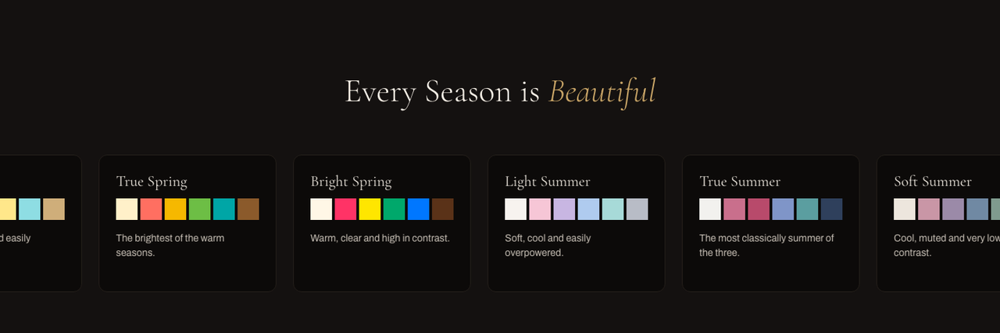
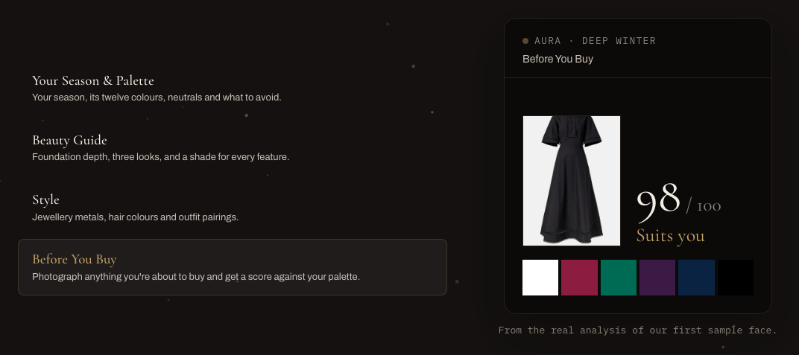
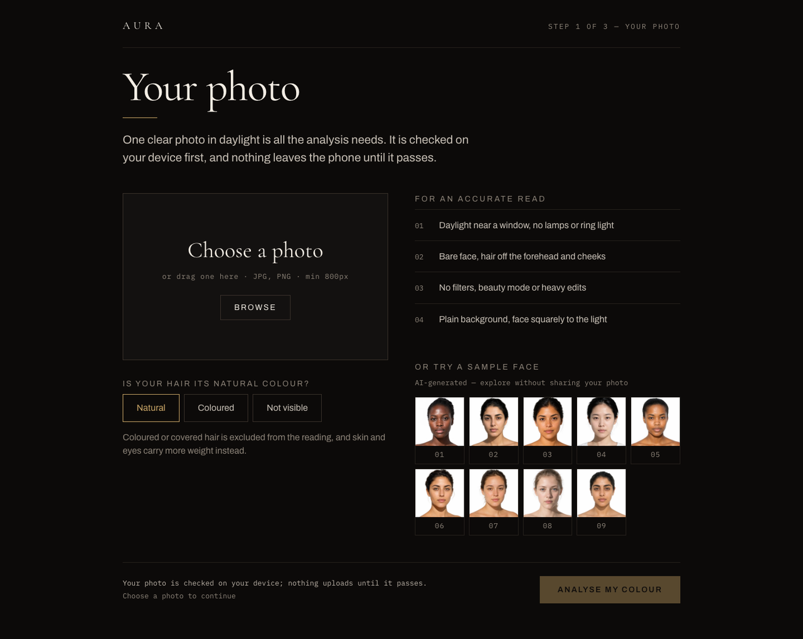
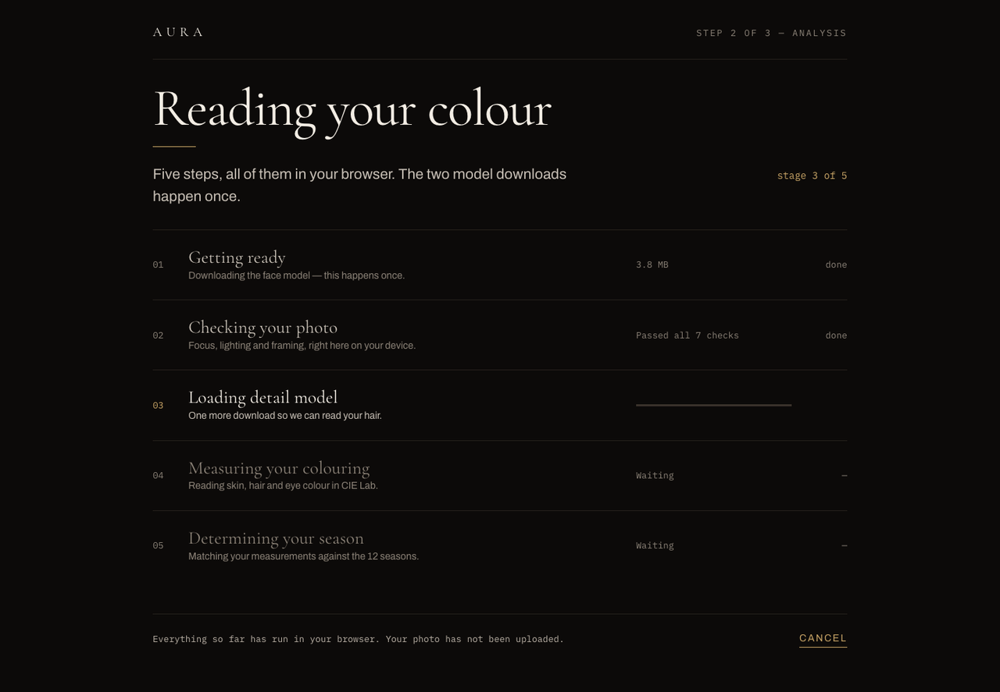
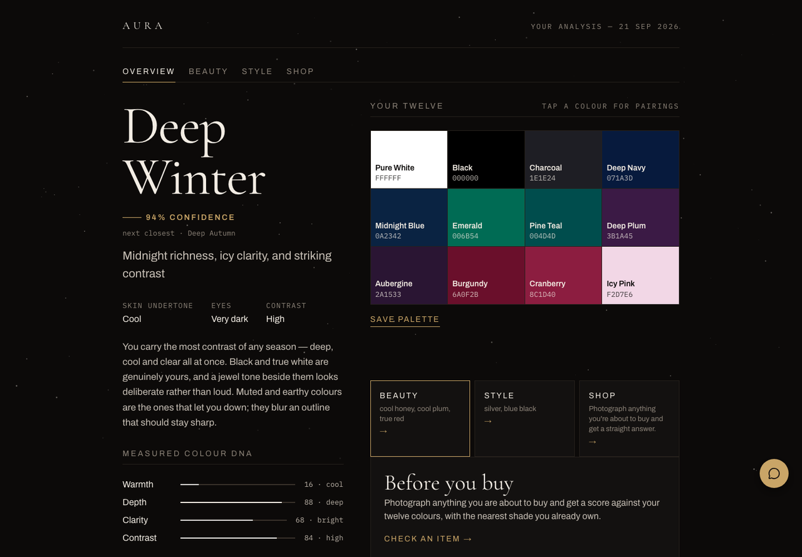
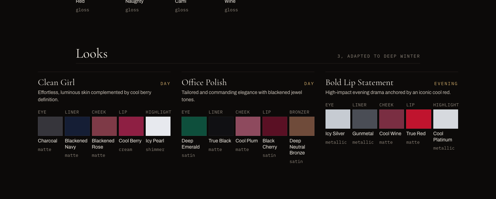
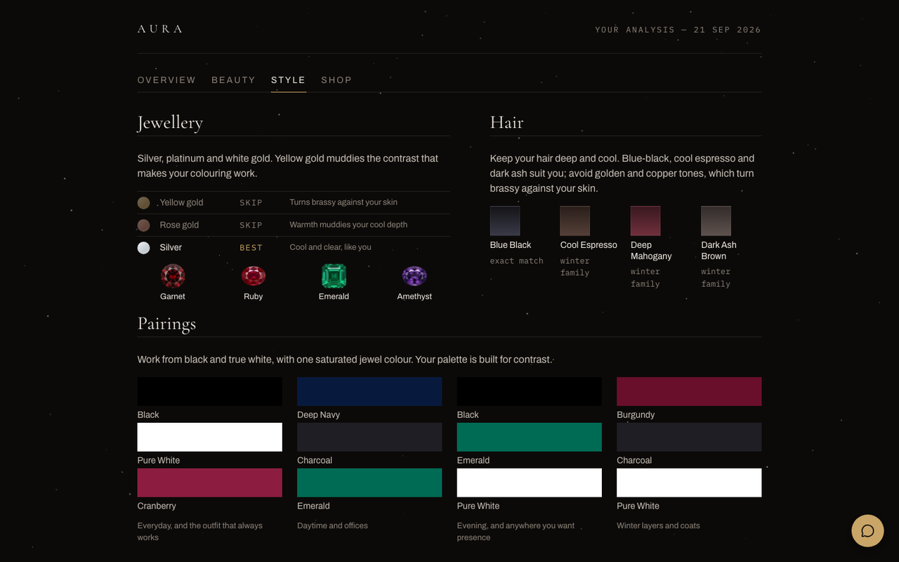
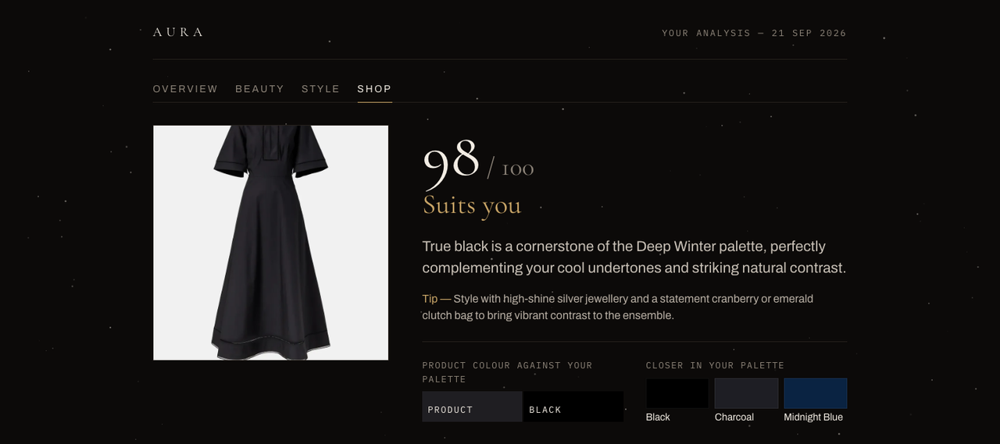
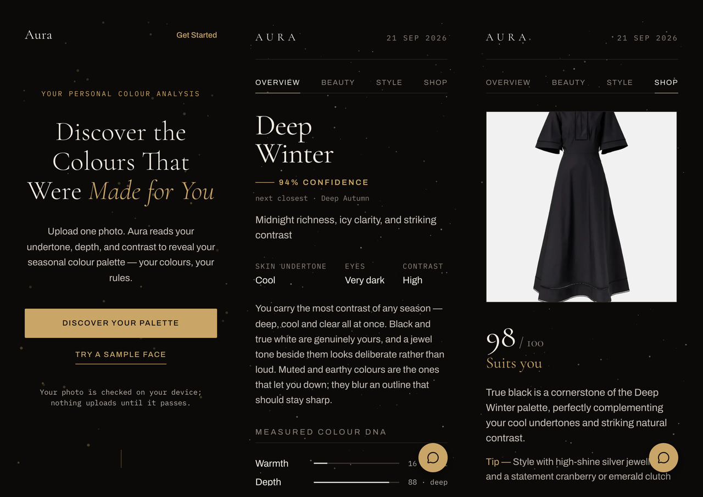

# Aura

Upload a photo and find out which of the 12 colour seasons you are. You get your palette, makeup shades, jewellery and hair colours, and you can check clothes against your palette before you buy them.

Live: https://aura-azure-six.vercel.app


## How it works

1. You upload one photo. It is checked in your browser first (lighting, focus, one face). If it fails, nothing is uploaded.
2. Your skin, hair and eye colours are measured on your device in CIE Lab.
3. The measurements are scored against the 12 seasons. A vision model looks at the photo and picks the final season from the top three.
4. You get four tabs: Overview, Beauty, Style and Shop.

The palettes, makeup shades, gemstones and hair colours are fixed lists per season. The model picks the season and names the looks, but it never invents a colour.

## Screenshots

**The 12 seasons**



**What you get**



**Upload**



**Analysing**



**Results**



**Makeup looks**



**Style**



**Before you buy**



**On a phone**



## Built with

- React 19, TypeScript, Vite 7, Tailwind 4
- MediaPipe (face landmarks and hair segmentation), running in the browser
- `@jsquash` WASM image decoders
- Vercel Functions for the API
- OpenRouter for the vision and chat models (Gemini Flash by default)
- Upstash Redis for daily rate limits
- Vitest and Playwright for tests
- GitHub Actions for a weekly end-to-end check of the live site

## Run it locally

You need Node 22 or newer and an [OpenRouter](https://openrouter.ai/keys) API key.

```bash
npm install
npm install --prefix client
cp .env.example .env        # then add your OPENROUTER_API_KEY
npm run dev                 # site on localhost:5173, API on localhost:3001
```

An analysis costs about $0.01 in model credit. The sample faces are free.

## Useful commands

```bash
npm test                    # unit tests
npm run e2e                 # full flow in a real browser (uses model credit)
npm run e2e:home            # landing page checks, free
npm run shots               # screenshots of every screen into dev/shots
npm run diagnose -- me.jpg  # show the measurements and ranking for a photo
```

## Folders

```
client/     the React app
api/        Vercel Functions, one file per route
server/     the route handlers, prompts and season data
measure/    the colour measurement code (runs in the browser)
eval/       accuracy testing
tests/      unit tests
scripts/    maintenance and dev tools
```

## Privacy

Photos are measured in the browser. The image that is sent for analysis is kept in memory only, never saved and never logged. Results are stored in your own browser, so a results link only opens on the device that made it.

## Limits

To keep costs under control each visitor gets 5 analyses, 10 shop checks and 15 chat messages a day.

## Notes

This is a personal project and the accuracy testing is still in progress. The sample faces are AI generated. `CLAUDE.md` has the architecture notes and a log of what was measured and changed.

MIT licence. Made by Haneen.
